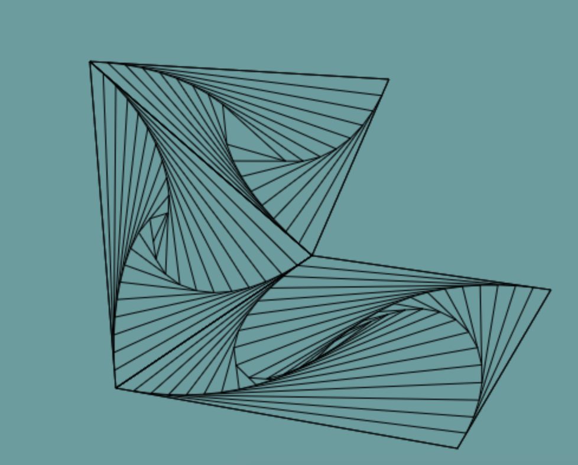

# Zen-Drawing-Generator
Generate zen drawings, also known as triangle/square illusions. 

For example:

*A Pen created at CodePen.io. You can find this one at http://codepen.io/skorper/pen/dpWxxE.*

## Usage

Click on the Instructions button for more info on the page itself. 

**Double click** to create a new polygon. 

**Single click** to create a new node in the polygon. 

<kbd>⎋ Escape</kbd> to cancel polygon creation. 

**Single click** on the starting point to finish a polygon. 

**Click and drag** a polygon node to move. 

Polygon nodes will be synced if they are very close. To unsync, click and drag quickly away from the original point. To sync, drag existing node onto another, or create a node on top of another. Moving synced points should move all points in the area. 

Probably obvious, but points must create a convex polygon in order for the pattern to be drawn. 
